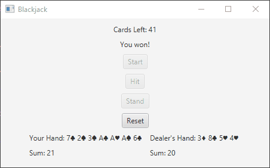
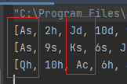

# Blackjack
A classic game of Blackjack where the user can play against the computer (aka the house).
The standard rules of Blackjack apply.

# First Iteration
The first part of the project was just a card drawing simulator where the user can draw
a card from the top of the deck, and the window shows the card. The shuffle button shuffles the deck
with the remaining cards left. The reset button shuffles the deck and returns all cards to the deck.

# Second Iteration
The full game of Blackjack, has features such as the playing getting BlackJack, the Ace being a 1 or
an 11, depending on what is favorable for the player, etc.

# Fun fact
I got 3 Blackjacks in a row, which is a 1 in 10000 chance of happening. Lol

1st pair: Ace of Spades & Jack of Diamonds

2nd pair: Ace of Spades & King of Spades

3rd pair: Queen of Hearts & Ace of Clubs

