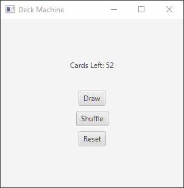

# Blackjack
A classic game of Blackjack where the user can play against the computer (aka the house).
The standard rules of Blackjack apply.

# First Iteration
The first part of the project was just a card drawing simulator where the user can draw
a card from the top of the deck, and the window shows the card. The shuffle button shuffles the deck
with the remaining cards left. The reset button shuffles the deck and returns all cards to the deck.

# Second Iteration
